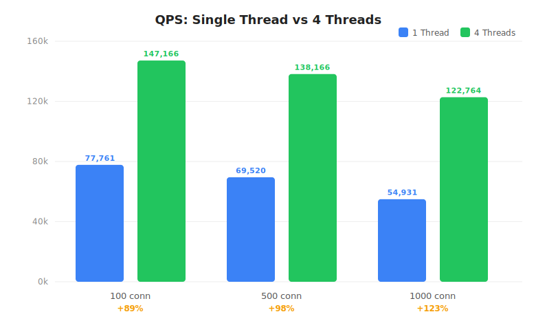

# 高性能 HTTP/1.1 服务器

[English](README_en.md) | 中文

一个用 C++17 从零实现的高性能 HTTP/1.1 服务器，仅使用 Linux 系统调用（epoll / socket / timerfd），无任何第三方网络库依赖。

受 [muduo](https://github.com/chenshuo/muduo)（陈硕）启发，采用**主从 Reactor** 多线程架构。

## 特性

- **主从 Reactor 架构** — MainLoop 负责 accept，SubLoop 处理所有 IO
- **epoll（ET 模式）** — 边缘触发，减少系统调用开销
- **多线程** — 可配置工作线程数，Round-Robin 连接分发
- **HTTP/1.1 解析** — 状态机解析器，支持半包/粘包场景
- **异步日志** — 双缓冲后台线程写入，支持日志级别过滤
- **空闲连接超时** — 周期检测并自动清理空闲连接
- **定时器系统** — 基于 timerfd 的定时器队列，集成到事件循环
- **零外部依赖** — 仅 Linux 系统调用 + C++17 标准库（测试使用 Google Test）

## 架构

```
┌─────────────────────────────────────────────┐
│                  Main Reactor                │
│   MainLoop（单线程）+ Acceptor               │
│   负责监听端口，accept 新连接                  │
└────────────────┬────────────────────────────┘
                 │ Round-Robin 分发
    ┌────────────┼────────────┐
    ▼            ▼            ▼
┌────────┐  ┌────────┐  ┌────────┐
│SubLoop1│  │SubLoop2│  │SubLoop3│   Sub Reactors
│（线程1）│  │（线程2）│  │（线程3）│   每个线程一个 EventLoop
└────┬───┘  └───┬────┘  └───┬────┘
     │          │            │
  Connection Connection  Connection
  HTTP解析    HTTP解析    HTTP解析
  读/写       读/写       读/写
```

## 目录结构

```
http-server/
├── CMakeLists.txt
├── README.md
├── README_en.md                   # English documentation
├── DESIGN.md                      # 详细设计文档
├── docs/
│   ├── phase1_log.md              # 阶段一：单线程 Reactor
│   ├── phase2_log.md              # 阶段二：HTTP 协议层
│   ├── phase3_log.md              # 阶段三：多线程 Reactor
│   └── phase4_log.md              # 阶段四：稳定性与可观测性
│
├── src/
│   ├── core/                      # 网络层
│   │   ├── inet_address.h/cpp     # sockaddr_in 封装
│   │   ├── buffer.h/cpp           # 应用层读写缓冲区（muduo 风格）
│   │   ├── poller.h/cpp           # epoll 封装
│   │   ├── channel.h/cpp          # fd 事件分发器
│   │   ├── event_loop.h/cpp       # Reactor 核心事件循环
│   │   ├── acceptor.h/cpp         # 端口监听器，接受新连接
│   │   ├── tcp_connection.h/cpp   # TCP 连接管理
│   │   ├── tcp_server.h/cpp       # 服务端入口（主从 Reactor）
│   │   ├── event_loop_thread.h/cpp       # 独立线程运行 EventLoop
│   │   └── event_loop_thread_pool.h/cpp  # Sub Reactor 线程池
│   │
│   ├── http/                      # HTTP 层
│   │   ├── http_request.h/cpp     # HTTP 请求数据模型
│   │   ├── http_response.h/cpp    # HTTP 响应构造与序列化
│   │   ├── http_parser.h/cpp      # 无状态请求行与头部解析器
│   │   ├── http_context.h/cpp     # 每连接状态机
│   │   └── http_server.h/cpp      # HTTP 服务器，封装 TcpServer
│   │
│   ├── utils/                     # 工具层
│   │   ├── timer.h/cpp            # 单个定时任务
│   │   ├── timer_queue.h/cpp      # 定时器管理（基于 timerfd）
│   │   └── logger.h/cpp           # 异步日志（双缓冲）
│   │
│   └── main.cpp                   # 入口
│
└── tests/                         # 单元测试（Google Test）
    ├── test_inet_address.cpp
    ├── test_buffer.cpp
    ├── test_poller.cpp
    ├── test_channel.cpp
    ├── test_event_loop.cpp
    ├── test_acceptor_connection.cpp
    ├── test_http_request_response.cpp
    ├── test_http_parser.cpp
    ├── test_event_loop_thread.cpp
    ├── test_event_loop_thread_pool.cpp
    ├── test_timer_queue.cpp
    ├── test_idle_connection.cpp
    └── test_logger.cpp
```

## 构建与运行

### 环境要求

- Linux（内核 2.6.27+，需要 `epoll_create1`）
- GCC 7+ 或 Clang 5+（支持 C++17）
- CMake 3.16+
- Google Test（未安装时 CMake 自动下载）

### 编译

```bash
# 克隆
git clone https://github.com/islxhere/cpp-http-server.git
cd cpp-http-server

# 编译
mkdir -p build && cd build
cmake ..
make -j$(nproc)
```

### 运行

```bash
# 启动 HTTP 服务器（端口 8080，4 个工作线程）
./build/http_server

# 用 curl 测试
curl http://localhost:8080/
# <h1>Hello! Handled by Thread: 12345</h1>

curl http://localhost:8080/other
# <h1>404 Not Found</h1>
```

### 运行测试

```bash
cd build
./run_tests
```

预期输出：

```
[==========] Running 69 tests from 14 test suites.
[  PASSED  ] 69 tests.
```

## 模块设计

### 网络层（core/）

| 模块 | 职责 |
|------|------|
| **InetAddress** | 封装 `sockaddr_in`，提供 IP + 端口的构造和访问接口 |
| **Buffer** | muduo 风格读写缓冲区，`readv` 分散读，预留 prepend 空间 |
| **Poller** | 封装 `epoll_create1` / `epoll_ctl` / `epoll_wait`，返回活跃 Channel |
| **Channel** | 管理单个 fd，绑定读/写/关闭/错误回调 |
| **EventLoop** | 驱动事件循环：poll → handleEvent → doPendingFunctors |
| **Acceptor** | 监听端口，循环 `accept4()`，通过回调通知上层 |
| **TcpConnection** | 代表一条 TCP 连接，持有输入输出 Buffer，`shared_ptr` 生命周期管理 |
| **TcpServer** | 管理 Acceptor + 所有连接，分发到 Sub Reactor |
| **EventLoopThread** | 在独立线程中启动 EventLoop，带同步机制 |
| **EventLoopThreadPool** | 管理 Sub Reactor 线程池，Round-Robin 连接分发 |

### HTTP 层（http/）

| 模块 | 职责 |
|------|------|
| **HttpRequest** | 存储解析后的 HTTP 请求（方法、路径、查询、头部、正文） |
| **HttpResponse** | 构造 HTTP 响应并序列化到 Buffer |
| **HttpParser** | 无状态静态方法：`parseRequestLine()`、`parseHeader()` |
| **HttpContext** | 驱动状态机从 Buffer 中解析 HTTP（处理半包/粘包） |
| **HttpServer** | 封装 TcpServer，通过 `std::any` 为每条连接绑定 HttpContext |

### 工具层（utils/）

| 模块 | 职责 |
|------|------|
| **Timer** | 单个定时任务，持有回调、过期时间和可选重复间隔 |
| **TimerQueue** | 使用 `timerfd` 管理所有定时器，将超时事件转化为 epoll 可读事件 |
| **Logger** | 异步单例日志系统，双缓冲后台线程写入 |

## 关键设计决策

### 为什么用 readv 而不是 read？

Buffer 的 `readFd()` 使用 `readv` 分散读，配合栈上 64KB 额外缓冲区。当 Buffer 可写空间不足时，数据先读到栈上缓冲区，再 append 到 Buffer，避免每次 read 前都要 `ensureWritableBytes` 的开销。

### 为什么 TcpConnection 用 shared_ptr？

TCP 连接的生命周期复杂：可能在回调中被关闭，也可能在发送数据时对端断开。`shared_ptr` + `enable_shared_from_this` 可以安全地在回调中传递 `shared_from_this()`，避免悬垂指针。

### 为什么用 timerfd 而不是 wait_for？

timerfd 可以直接注册到 epoll 中，超时事件和 IO 事件在同一个事件循环中处理，不需要额外的线程。

### 为什么用双缓冲日志？

前端加锁写入 `buffer_`，然后 `notify_one()`。后台线程将 `buffer_` swap 到局部 vector（O(1) 指针交换），立即释放锁，然后不持有锁地写文件。最大限度减少锁竞争，确保日志不会阻塞 IO 线程。

## 测试覆盖

| 测试套件 | 测试数 | 覆盖范围 |
|----------|--------|----------|
| InetAddressTest | 6 | IP/端口构造，sockaddr 转换 |
| BufferTest | 11 | 读写、readfd、prepend、扩容 |
| ChannelTest | 10 | 事件使能/禁用、回调分发 |
| PollerTest | 7 | epoll 生命周期、多 Channel |
| EventLoopTest | 1 | timerfd 集成测试 |
| AcceptorConnectionTest | 1 | 端到端 echo 测试 |
| HttpRequestTest | 6 | 请求数据模型 |
| HttpResponseTest | 8 | 响应序列化 |
| HttpParserTest | 5 | 半包、粘包、Keep-Alive |
| EventLoopThreadTest | 4 | 线程同步、回调分发 |
| EventLoopThreadPoolTest | 3 | Round-Robin、多线程分发 |
| TimerQueueTest | 2 | 一次性/重复定时器 |
| IdleConnectionTest | 2 | 空闲超时踢出、活跃连接保活 |
| LoggerTest | 3 | 万行多线程写入、日志级别过滤 |
| **合计** | **69** | |

## 技术选型

| 选项 | 选择 | 原因 |
|------|------|------|
| IO 多路复用 | epoll（ET 模式） | Linux 最高效，ET 模式减少系统调用 |
| 线程模型 | 主从 Reactor | 业界主流方案（Nginx / Netty） |
| C++ 标准 | C++17 | `string_view`、`optional`、`any`、结构化绑定 |
| 构建系统 | CMake 3.16+ | 业界标准 |
| 测试框架 | Google Test | 主流，集成方便 |
| 序列化 | 无（纯文本 HTTP） | 零外部依赖 |

## 开发日志

各阶段详细开发日志位于 `docs/` 目录：

- [阶段一：单线程 Reactor](docs/phase1_log.md) — 核心网络层（8 个模块）
- [阶段二：HTTP 协议层](docs/phase2_log.md) — HTTP 解析与响应（5 个模块）
- [阶段三：多线程 Reactor](docs/phase3_log.md) — 线程池与连接分发（3 个模块）
- [阶段四：稳定性与可观测性](docs/phase4_log.md) — 定时器、空闲超时、异步日志（6 个模块）

## 代码统计

| 目录 | 文件数 | 行数 |
|------|--------|------|
| src/core/ | 20 | ~1,600 |
| src/http/ | 10 | ~608 |
| src/utils/ | 6 | ~553 |
| src/main.cpp | 1 | 48 |
| tests/ | 13 | ~1,549 |
| **合计** | **50** | **~4,358** |

## 压力测试

测试环境：Linux 6.8.0 / 4 核 CPU / wrk 4.1.0 / 每轮 10 秒



### QPS 对比

| 并发连接 | 单线程 | 4 线程 | 提升幅度 |
|----------|--------|--------|----------|
| 100 | 77,761 req/s | 147,166 req/s | **+89%** |
| 500 | 69,520 req/s | 138,166 req/s | **+99%** |
| 1000 | 54,931 req/s | 122,764 req/s | **+123%** |

### 延迟对比

| 并发连接 | 单线程（平均） | 4 线程（平均） |
|----------|----------------|----------------|
| 100 | 1.28 ms | 0.96 ms |
| 500 | 7.15 ms | 3.90 ms |
| 1000 | 18.10 ms | 8.39 ms |

### 吞吐量对比

| 并发连接 | 单线程 | 4 线程 |
|----------|--------|--------|
| 100 | 9.49 MB/s | 17.96 MB/s |
| 500 | 8.49 MB/s | 16.87 MB/s |
| 1000 | 6.71 MB/s | 14.99 MB/s |

> 交互式图表请在浏览器中打开 [docs/benchmark.html](https://islxhere.github.io/cpp-http-server/docs/benchmark.html)。

## 开源协议

本项目仅供学习使用。
